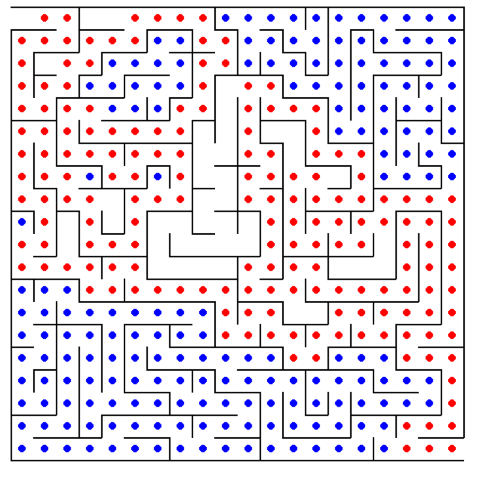

# 🧩 Building and Running Mazes (Python + Pygame)

A fully interactive maze generation and maze solving visualization project built using **Python** and **Pygame**.  
This project demonstrates how classical graph traversal algorithms such as **Depth First Search (DFS)** and **stack-based backtracking** can be used to dynamically generate and solve proper mazes in real time.

The project visually simulates an invisible “mouse” that:
- Generates a perfect maze using DFS
- Solves the maze step-by-step
- Visualizes exploration, backtracking, and the final path

---

# 📌 Project Overview

The objective of this project is to:

1. Generate a random rectangular maze  
2. Visually display the maze using graphics  
3. Automatically solve the maze  
4. Visualize traversal and backtracking in real time  

The project implements:

- Stack-based DFS maze generation  
- Stack-based DFS maze solving  
- Proper maze structure (perfect maze / tree graph)  
- Animated wall removal  
- Red path visualization (active traversal)  
- Blue path visualization (dead ends)  
- Fixed start (top-left) and end (bottom-right)  
- Python + Pygame rendering system  
- Modular project architecture  

---

# 🎯 Features

- Random perfect maze generation  
- Real-time animation of maze creation  
- Stack-based DFS backtracking algorithm  
- Automatic maze solver  
- Red visualization for active path  
- Blue visualization for dead ends  
- Fixed start: top-left `(0, 0)`  
- Fixed end: bottom-right `(ROWS-1, COLS-1)`  
- Clean Pygame graphical interface  
- Modular Python file structure  

---

# 🧠 Maze Generation Algorithm — DFS Backtracking

The maze generation system uses a **Depth First Search (DFS)** traversal algorithm combined with a **stack for backtracking**.

The maze begins as a fully closed grid where all walls are intact.

An invisible “mouse” starts at the top-left cell and performs the following steps:

1. Checks all neighboring cells  
2. Selects a random unvisited neighbor  
3. Removes the wall between current and neighbor  
4. Pushes current cell onto a stack  
5. Moves to the selected neighbor  

When the mouse reaches a dead end:

- It pops from the stack  
- Backtracks to the previous cell  
- Continues exploring remaining paths  

This process continues until all cells are visited.

### 🧩 Result

The maze becomes a **perfect maze (tree structure)**:
- All cells are connected  
- Exactly one path exists between any two points  
- No isolated regions exist  

---

# 🐭 Stack-Based DFS “Mouse” Logic

The project simulates a virtual mouse that:

- Explores neighboring cells  
- Randomly chooses directions  
- Removes walls dynamically  
- Uses a stack for memory  
- Backtracks when stuck  

This creates a real-time visualization of maze construction.

---

# 🧱 Maze Representation

The project uses the required assignment structure:

```python
northWall = [[1 for _ in range(COLS)] for _ in range(ROWS + 1)]
eastWall  = [[1 for _ in range(COLS + 1)] for _ in range(ROWS)]
````

---

## 🔍 Meaning of Values

* `1` → wall exists
* `0` → wall removed

---

## 🧩 Wall Types

* `northWall` → horizontal walls
* `eastWall` → vertical walls

---

# 🎨 Visualization (Pygame)

The project uses **Pygame** to render everything in real time:

* Maze walls (black lines)
* Solver path (red dots)
* Dead ends (blue dots)
* Animated traversal

---

# 🧭 Maze Solver Algorithm

After generation, a second **DFS-based solver** finds the path.

### Behavior:

* Starts at `(0, 0)` (top-left)
* Moves only through valid paths
* Uses stack-based exploration
* Backtracks when stuck
* Continues until reaching goal

### End Condition:

```
(ROWS - 1, COLS - 1)
```

---

# 🔴🔵 Solver Visualization

## 🔴 Red Dots

* Active traversal path
* Current exploration route

## 🔵 Blue Dots

* Dead ends
* Backtracking paths

---

# 🚪 Start and End Points

The maze is fixed as:

* 🟢 Start → `(0, 0)` (top-left)
* 🔴 End → `(ROWS - 1, COLS - 1)` (bottom-right)

---

# 🛠️ Technologies Used

| Technology    | Purpose                     |
| ------------- | --------------------------- |
| Python 3      | Core programming language   |
| Pygame        | Graphics rendering          |
| DFS Algorithm | Maze generation and solving |
| Stack         | Backtracking mechanism      |
| Git           | Version control             |
| GitHub        | Repository hosting          |

---

# 📂 Project Structure

```
maze-project/
│
├── src/
│   ├── main.py
│   ├── maze_generator.py
│   ├── maze_solver.py
│   ├── renderer.py
│   ├── constants.py
│
├── screenshots/
│   └── final_maze.png
│
├── README.md
```

---

# ⚙️ How to Run the Project

## 1. Install dependencies

```bash
pip install pygame
```

## 2. Run the project

```bash
python src/main.py
```

---

# 📸 Screenshots

## 🧩 Final Maze Output



---

# 🧠 Key Concepts Demonstrated

* Depth First Search (DFS)
* Stack-based backtracking
* Graph traversal
* Procedural maze generation
* Pathfinding algorithms
* Real-time graphical rendering

---

# 🧩 System Workflow

## Maze Generation:

* Start at top-left
* Randomly explore neighbors
* Remove walls between cells
* Backtrack when stuck
* Build full connected maze

## Maze Solving:

* Start at top-left
* Explore valid paths
* Track visited nodes
* Backtrack on dead ends
* Reach bottom-right goal

---

# 🏁 Final Result

✔ Random maze generation
✔ Automated maze solving
✔ Real-time visualization
✔ DFS + stack-based logic
✔ Correct start and end behavior
✔ Exploration + backtracking visualization

---

# 🚀 Conclusion

This project demonstrates how **graph algorithms (DFS)** and **stack-based backtracking** can be used to generate and solve mazes visually.

It combines:

* Algorithm design
* Data structures
* Graph theory
* Real-time graphics (Pygame)
* Software modularity

into a complete interactive system.

```

---

